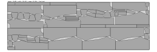
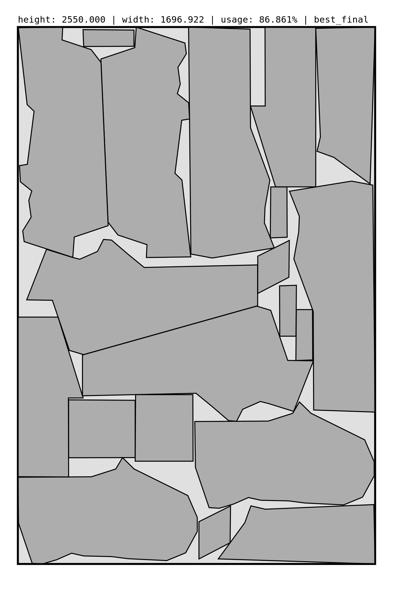
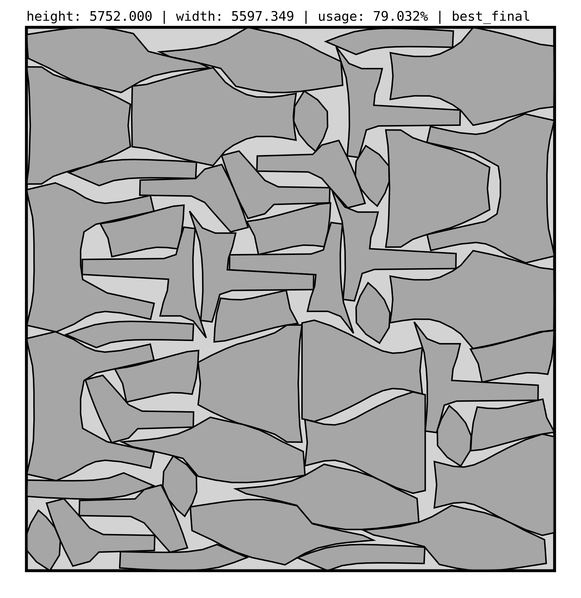
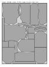
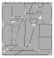
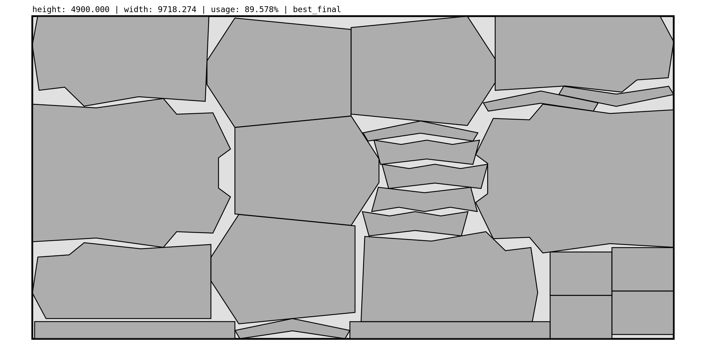

# nest-rs 🐦🪺

A state-of-the-art heuristic for the 2D irregular strip packing problem.

Built on top of the [`jagua-rs`](https://github.com/JeroenGar/jagua-rs) collision detection engine.

Some example solutions:
<p align="center">
    
    
</p>
<p align="center">
    
    
    
</p>
<p align="center">
    
    
</p>

## Requirements
- Rust ≥ 1.85

This repository contains [`jagua-rs`](https://github.com/JeroenGar/jagua-rs) as a submodule.
Make sure it is initialized and up to date:
```bash
git submodule update --init --recursive
```

## Usage

General usage:
```bash
cargo run --release  -- \
    [path to input JSON] \
    [timelimit exploration phase in seconds]
```

Concrete example:
```bash
cargo run --release -- \
    libs/jagua-rs/assets/swim.json \
    120
```

If you want to view the optimization process live, open `assets/live_solution_viewer.html` in a web browser,
and compile with the `live_svg` feature enabled:

```bash
rm output/.live_solution.svg
open assets/live_solution_visualizer.html
cargo run --release --features=live_svg -- \
    [path to input JSON] \
    [timelimit exploration phase in seconds]
```


For ultimate performance:
```bash
RUSTFLAGS='-C target-cpu=native'
cargo run --profile release -- \
    [path to input JSON] \
    [timelimit exploration phase in seconds]
```

## Input

🚧

## Output

Solutions will be exported as SVG files in `/output` folder.
These SVGs contain all the original shapes and transformations applied to them:
```html
    ...
    <g id="items">
        <defs>
            <g id="item_0">...</g>
        </defs>
        <use transform="translate(1289.9116 1828.7717), rotate(-90)" xlink:href="#item_0">...</use>
    </g>
    ...
```
