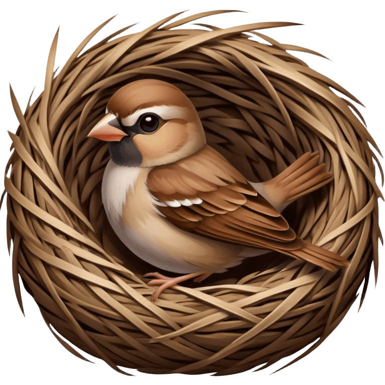
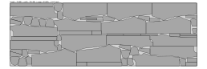
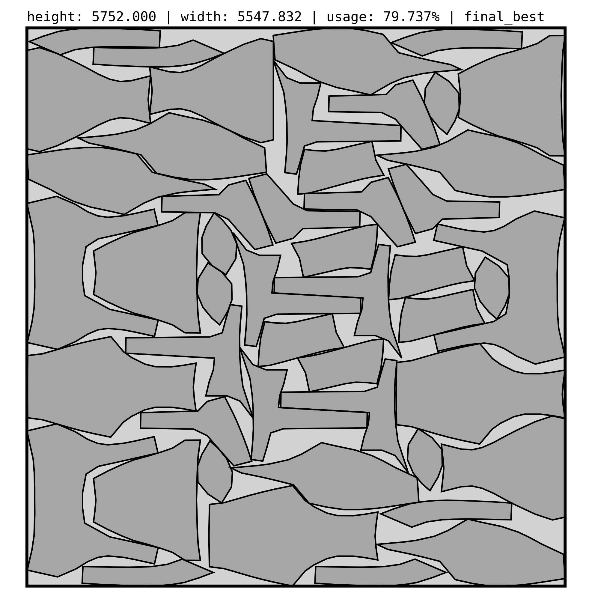
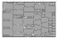

# sparrow 🪶 [](https://github.com/JeroenGar/sparrow/actions/workflows/rust_ci.yml) 

> Sparrows are master weavers, crafting nests with intricate patterns. They utilize geometry and symmetry to ensure structural integrity and stability. By incorporating precise angles, lengths, and weaving patterns, these birds achieve a balance between strength and efficiency.
[(read more)](https://www.mathnasium.com/math-centers/happyvalley/news/mathematical-marvels-bird-nest-construction-hv#)

### The state-of-the-art nesting heuristic for 2D irregular strip packing
`sparrow` can be used to solve 2D irregular strip packing problems, also commonly referred to as nesting problems.
This optimization algorithm builds on [`jagua-rs`](https://github.com/JeroenGar/jagua-rs): a collision detection engine for 2D irregular cutting & packing problems.

<p align="left">
    
</p>

## Built by sparrow
<p align="center">
    
    
</p>
<p align="center">
    
    
    
</p>
<p align="center">
    
    
</p>

## Requirements
- [Rust](https://www.rust-lang.org/tools/install) ≥ 1.86

## Usage

General usage:
```bash
cargo run --release  -- \
    -i [path to input JSON] \
    -t [timelimit in seconds (default is 600s)]
```
By default 80% of the time is spent exploring and 20% is spent compressing.
Alternatively, it is also possible explicitly define explore and compression times:
```bash
cargo run --release  -- \
    -i [path to input JSON] \
    -e [explore time in seconds] \
    -c [compression time in seconds]
```
Pressing 'Ctrl + C' immediately moves the algorithm to the next phase.

Concrete example:
```bash
cargo run --release -- \
    -i data/input/swim.json
```

## Visualizer

This repo contains a simple visualizer to monitor the optimization process live.
Open [live_viewer.html](data/live/live_viewer.html) in a web browser,
and build `sparrow` with the `live_svg` feature enabled:

```bash
cargo run --release --features=live_svg -- \
    -i data/input/swim.json
```


## Input

This repository uses the same JSON format as [`jagua-rs`](https://github.com/JeroenGar/jagua-rs) to represent instances.
These are also available in Oscar Oliveira's [OR-Datasets repository](https://github.com/Oscar-Oliveira/OR-Datasets/tree/master/Cutting-and-Packing/2D-Irregular).

See [`jagua-rs` README](https://github.com/JeroenGar/jagua-rs?tab=readme-ov-file#input) for details on the input format.

## Output

Solutions are exported as SVG files in the `output` folder. 
The final SVG solution is saved as `output/final_{name}.svg`.

The SVG files serve both as a visual and exact representation of the solution.
All original shapes and their exact transformations applied to them are defined within the SVG:
```html
    ...
    <g id="items">
        <defs>
            <g id="item_0">...</g>
        </defs>
        <use transform="translate(1289.9116 1828.7717), rotate(-90)" xlink:href="#item_0">...</use>
    </g>
    ...
```
The [SVG spec](https://stackoverflow.com/questions/18582935/the-applying-order-of-svg-transforms) defines that the transformations are applied from right to left.
So here the item is always first rotated and then translated.

By default, a range of intermediate (and infeasible) solutions will be exported in `output/sols_{name}`.
To disable this and export only a single final solution, compile with the `only_final_svg` feature:
```bash
cargo run --release --features=only_final_svg -- \
    -i data/input/swim.json
```
## Targeting maximum performance

Make sure `target-cpu=native` compiler flag is set, 
switch to the nightly toolchain (required for [SIMD](https://doc.rust-lang.org/std/simd/index.html) support) 
and enable the `simd` feature:

```bash
  export RUSTFLAGS='-C target-cpu=native'
  export RUSTUP_TOOLCHAIN=nightly
  cargo run --release --features=simd,only_final_svg -- \
      -i data/input/swim.json
```

## Testing
A suite of `debug_assert!()` checks are included throughout the codebase to verify the correctness of the heuristic.
These assertions are omitted in release builds to maximize performance, but are active in test builds.
Some basic integration tests are included that run the heuristic on a few example instances while all assertions are active:
```bash
  cargo test
```

Alternatively you can enable all `debug_assert!()` checks in release builds by running the tests with the `debug-release` profile:
```bash
cargo run --profile debug-release -- \
    -i data/input/swim.json
```

## Experiments
All solutions from the comparative experiments in [TBA] can be found at
[data/experiments](data/experiments).
The accompanying [README](data/experiments/README.md) details how to perform an exact reproduction of any benchmark run.

## Development

This repo is meant to remain a faithful representation of the algorithm described in [TBA].
However, I am open to pull requests containing bug fixes and speed/performance improvements as long as they do not alter the algorithm too significantly.

Feel free to fork the repository if you want to experiment with different heuristics or want to expand the functionality.

## License

This project is licensed under Mozilla Public License 2.0 - see the [LICENSE](LICENSE) file for details.

## Acknowledgements

This project began development at the CODeS research group of [NUMA - KU Leuven](https://numa.cs.kuleuven.be/) and was funded by [Research Foundation - Flanders (FWO)](https://www.fwo.be/en/) (grant number: 1S71222N).
<p>

&nbsp;

</p>
